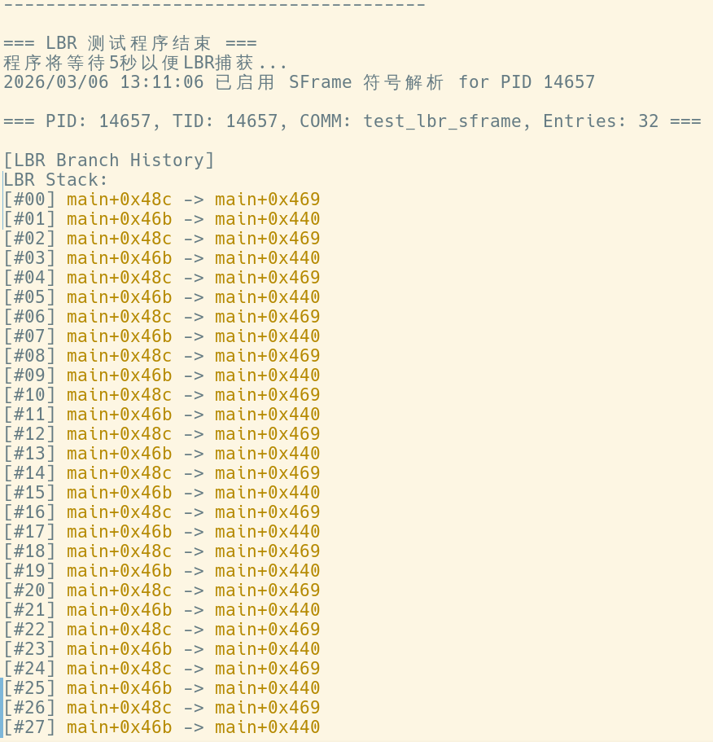
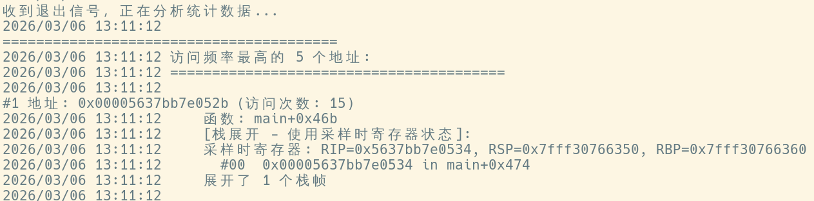

正在收集工作区信息# 工作报告：LBR 用户态符号解析项目（简短总结）

## 项目概述
该项目基于 eBPF 捕获 Last Branch Record (LBR)，并在用户态将原始地址解析为可读的函数名和源代码位置，支持多种解析策略（addr2line、DWARF、SFrame）。

## 主要组件与关键文件
- CLI / 运行入口：main.go  
- eBPF 程序：bpf_lbr.c 与生成的头文件 vmlinux.h  
- 用户态符号解析核心：
  - DWARF 解析：`lbr.DwarfResolver.ResolveAddress`、`lbr.DwarfResolver.findSymbolInList`（查看实现：dwarf_resolver.go）
  - SFrame 解析：`lbr.SFrameResolver.findSymbol`、FDE 查找函数 `lbr.findFDEForFunction`（文件：sframe_resolver.go）
  - 用户进程解析：`lbr.NewUserSymbolResolver`、`lbr.UserSymbolResolver.ResolveAddress`、`lbr.UserSymbolResolver.ResolveBatchAddresses`（文件：usersym.go）
- 辅助：kallsyms 加载与查找：`lbr.LoadKallsyms`（文件：disasm.go）
- 示例与测试：示例程序目录 stack_unwinding；测试脚本 test_stack_unwinding.sh；测试 Makefile Makefile
- 文档：快速开始与符号解析说明 QUICKSTART_SYMBOL.md、SYMBOL_RESOLUTION.md

## 核心功能（现状）
- 支持三种用户态地址解析模式：addr2line（默认）、DWARF（需要调试信息）、SFrame（轻量栈展开）。参见 CLI 选项：main.go。
- eBPF 负责高效采集分支记录，用户态模块负责符号解析并格式化输出。
- 提供批量解析接口以提高 addr2line 的性能：internal/usersym.go#ResolveBatchAddresses。

## 测试与示例
- 提供编译与运行脚本/Makefile，用于生成测试二进制（含 SFrame/DWARF）和运行对比测试（见 Makefile 与 test_stack_unwinding.sh）。
- 示例：examples/stack_unwinding 包含演示程序和运行示例。

## PMU 信息
项目中包含一个 `pmu` 目录，用于采集和分析硬件性能计数器，与 LBR 数据结合可用于定位性能热点和硬件事件相关的分支行为。该目录主要内容包括：

- 各类 PMU 测试与监控程序（目录结构示例）：
  - `dtlb` / `dtlb.c`：数据 TLB 测试与监控
  - `itlb` / `itlb.c`：指令 TLB 测试与监控
  - `l1_dcache` / `l1_dcache.c`：L1 数据缓存监控
  - `l1_icache` / `l1_icache.c`：L1 指令缓存监控
  - `l1d_pend_miss` / `l1d_pend_miss.c`：L1 延迟挂起缺失监控
  - `llc_cache` / `llc_cache.c`：最后一级缓存监控
  - `mem_inst` / `mem_inst.c`：内存指令相关事件监控
  - `pmu_monitor_all` / `pmu_monitor_all.c`：综合监控脚本
  - `Makefile`：构建这些工具的 Makefile
## Shell 脚本与可视化
仓库中的 `shell` 目录包含用于分析 LBR 热点与 PMU 数据的脚本和绘图工具，方便从原始数据生成可视化结果并进行深入分析。主要文件与用途：

- `analyze_lbr_hotspots.py`：自动化分析 LBR 热点，聚合与导出候选函数/地址。
- `parse_lbr_symbols.py`：解析 LBR 导出数据并映射符号信息（用于后续绘图或统计）。
- `visualize_lbr.py`：将 LBR 与解析后的符号信息可视化，支持不同时间/线程的过滤。
- `plot_*.py`（如 `plot_dtlb.py`、`plot_itlb.py` 等）：针对各类 PMU 事件生成图表，便于对比不同事件与 LBR 热点的关联性。

示例图片（位于 `shell` 目录下）：

## 目前存在问题

- 只能获取采样时的regs信息,无法获取lbr内部捕获的地址时的regs信息

